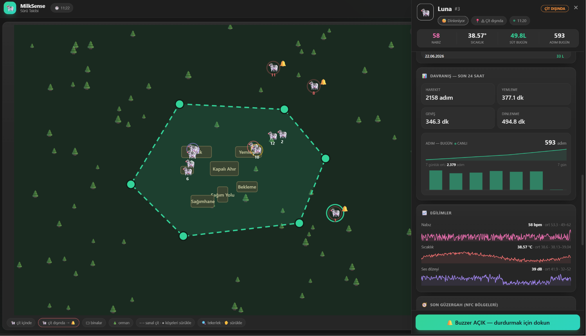

# 🐄 MilkSense

Open-source smart tracking for dairy herds. A LoRa ear-tag streams each cow's
vitals, motion, and location to a gateway; a small ML backend turns that raw
sensor data into **behaviour** and **health** signals; a live dashboard shows
the herd on a map with alerts for heat, illness, low feeding, falling yield,
and fence breaks.

**▶ [Live demo](https://hamzayslmn.github.io/Open-MilkSense/)** — runs entirely in your browser, no backend needed.

[](https://hamzayslmn.github.io/Open-MilkSense/)

## How it works

```
Cow ear-tag (ESP32 slave) ──LoRa──▶ Gateway (ESP32 master) ──▶ Backend (ML) ──▶ Dashboard
```

The repo has three independent parts:

| Folder | What it is | Stack |
|--------|-----------|-------|
| [`Esp32/`](Esp32) | Firmware for the tag (`slave`) and the gateway (`master`) | Arduino / C++ |
| [`backend/`](backend) | Condition-monitoring ML — behaviour + health models, cow detection | Python, scikit-learn → ONNX, YOLO26 |
| [`frontend/`](frontend) | Live dashboard with a built-in herd simulation (no backend needed) | React + Vite + Tailwind |

## Sensors

Each tag ships one 36-byte LoRa `Report` packet
([`slave/src/lora.h`](Esp32/slave/src/lora.h)) carrying every field below; the
gateway appends LoRa link quality on receipt.

| Sensor | Part | Bus | Measures |
|--------|------|-----|----------|
| Heart rate | MAX30102 | I²C | Pulse, bpm (0 = no skin contact) |
| Motion / steps | MPU6050 | I²C | 3-axis accel → step count |
| Body temperature | DS18B20 | 1-Wire | °C |
| Real-time clock | DS3231 | I²C | Unix timestamp per reading |
| Location | NEO-6M/8M GPS | UART | Latitude, longitude, satellite count |
| Acoustics | INMP441 mic | I²S | Sound level + cough/vocalization events |
| ID | UHF RFID reader (M6E Nano) + UHF band antenna | UART | 96-bit EPC ear-tag over the 865–868 MHz EU UHF band, read at gate zones |
| Battery | 18650 Li-ion cell | ADC | Charge % |
| LoRa link *(gateway)* | SX127x radio | SPI | RSSI + SNR per report |

## Quick start

### Dashboard (no hardware required)

The frontend ships with an in-browser herd simulation, so you can run the whole
demo standalone:

```bash
pnpm --dir frontend install
pnpm --dir frontend run dev        # http://localhost:5173
```

Pan/zoom the map, click a cow for full detail, and **drag the virtual fence
corners** — strays light up and buzz the moment the fence crosses them. The
demo seeds a few anomaly cows (heat, fever, low feeding, declining yield) plus
strays grazing outside the fence.

### Backend ML

Uses [uv](https://docs.astral.sh/uv/) (Python 3.14):

```bash
cd backend && uv sync

# Train the behaviour + health models and export to ONNX
uv run src/modules/scikit/main.py
uv run src/modules/scikit/test.py        # validate the ONNX models

# Detect & count cows in a photo (YOLO26)
uv run src/modules/yolo/main.py
```

- **Behaviour model** — what a cow is doing (resting, eating, grazing, milking…).
- **Health model** — flags fever / distress from vitals + acoustic events.
- Both train on the ESP32 sensor fields only, export to `.onnx`, and run via `onnxruntime`.

### Firmware

Open `Esp32/slave/slave.ino` (tag) or `Esp32/master/master.ino` (gateway) in
the Arduino IDE / PlatformIO and flash to an ESP32. Sensor and LoRa drivers
live under each `src/`.

## License

See [LICENSE](LICENSE).
